# FourJunctions--Assignment

- [Kubernetes](#kubernetes)
- [Terraform](#terraform)

## Kubernetes
1. **Setup Master and Worker Nodes**

   First, I set up a Kubernetes cluster with a master node and worker node. I configured and make them connected.
   ```sh
   kubectl get nodes

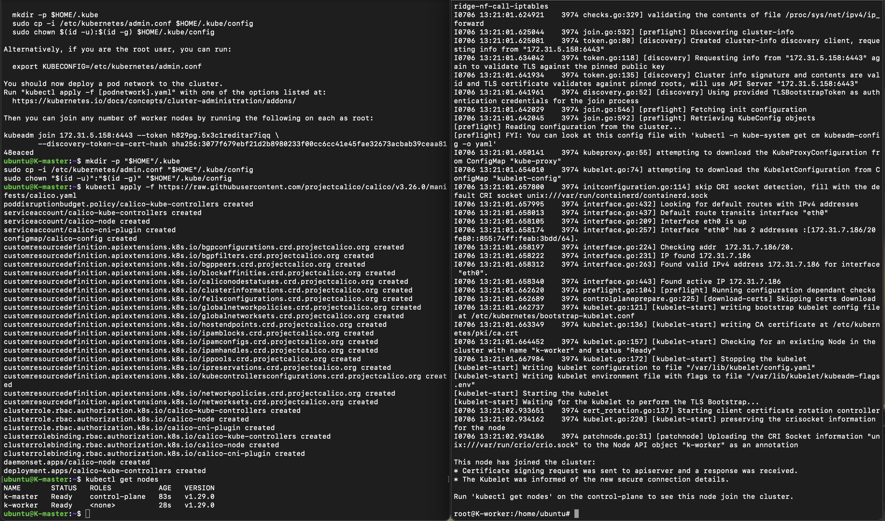

2. **Setting up ingress-controller**
   
   ```sh
   kubectl apply -f https://raw.githubusercontent.com/kubernetes/ingress-nginx/controller-v1.1.3/deploy/static/provider/baremetal/deploy.yaml


3. **Creation of `server-ingress.yaml` to create namespace, service, deployment, and ingress-class-object**
   <br>
   It also involves checking for ingress resources and controller.
   ```sh
   kubectl get services -n ingress-nginx
   kubectl -n ingress-nginx get ingressclasses
   cat server-ingress.yaml

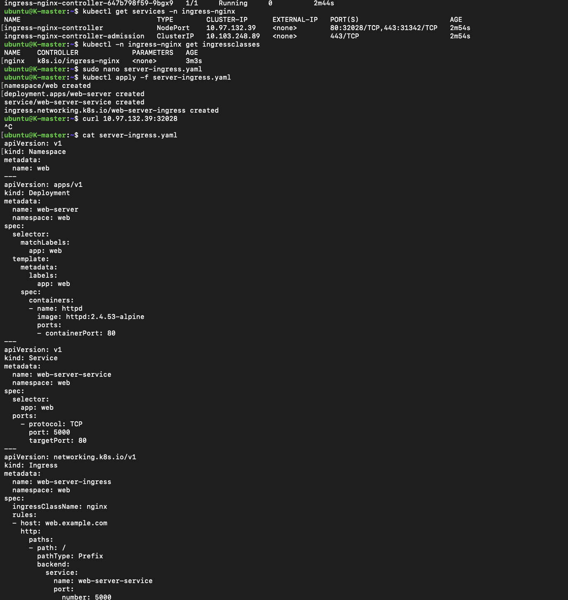

4. **Verify Resources and Access application (www.example.com) using the NodePort**
   <br>
   To check that the resources (Deployments, Services, Pods, Ingress) are created successfully.
   ```sh
   #To view resources
   kubectl get deploy -n ingress-nginx -o wide
   kubectl get svc -n ingress-nginx -o wide
   kubectl get pods -n ingress-nginx -o wide
   kubectl -n ingress-nginx get ingressclasses

   #To access application using NodePort
   curl 172.31.7.186:32028 -H 'Host: web .example.com'
   
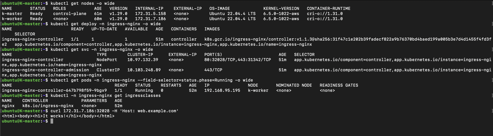

## Terraform

1. **Installation of Terraform in the Ubuntu Instance.**
   ```sh
   wget -O- https://apt.releases.hashicorp.com/gpg | sudo gpg --dearmor -o /usr/share/keyrings/hashicorp-archive-keyring.gpg
   echo "deb [signed-by=/usr/share/keyrings/hashicorp-archive-keyring.gpg] https://apt.releases.hashicorp.com $(lsb_release -cs) main" | sudo tee       /etc/apt/sources.list.d/hashicorp.list
   sudo apt update && sudo apt install terraform
   terraform --version
   which terraform


2. **Configure AWS CLI to inject ACCESS_KEY and SECRET_KEY.**
   ```sh
   aws configure

3. **Initialising Terraform in my working directory, and Validate the syntax and configuration of the Terraform files.** 
   ```sh
   cd FourJunctions/AWS
   ls
   terraform init
   terraform validate


4. **Generate and review an execution plan for Terraform**
   ```sh
   terraform plan


5. **Now, Applying the Terraform execution plan to make changes to the infrastructure as defined in the Terraform configuration files. (`variables.tf`, `vpc.tf` ,`autoscaling.tf` and `route53.tf`)**

   **Note**: Due to the unavailability of a domain, I've skipped the Route53.tf file from terraform execution, but the file is there for the steps to be followed for the Route53                setup through terraform.
   ```sh
   terraform apply --auto-approve

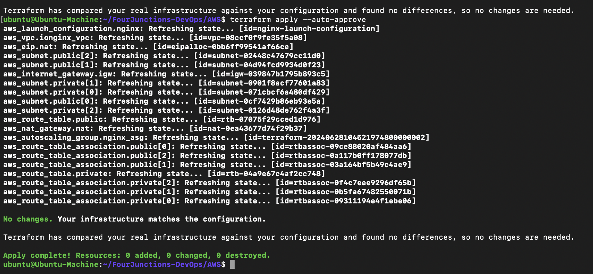

6. **After the successful infrastructure creation through Terraform, two instances named `nginx-asg` are created, with Public IP and SSH disabled.**
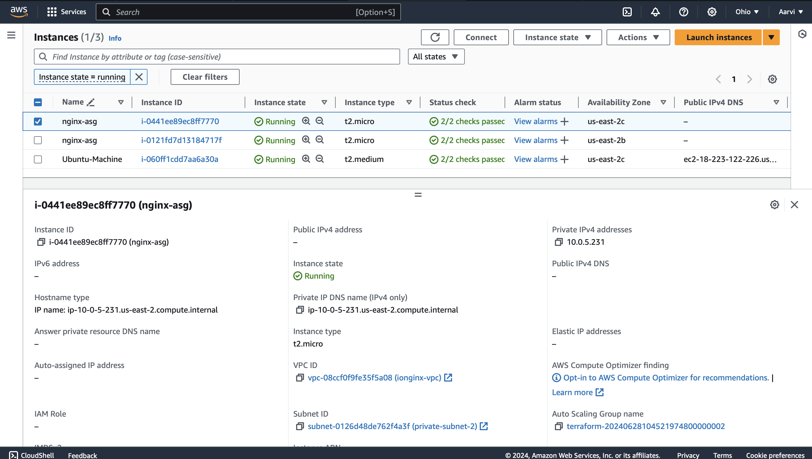
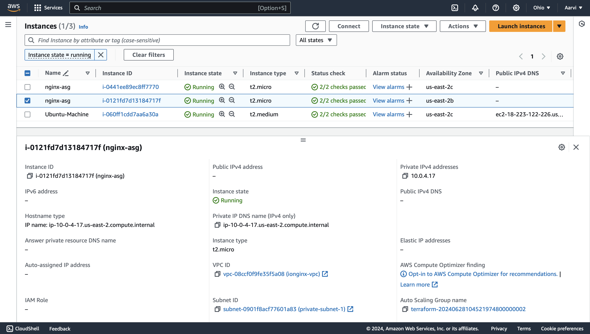

7. **As per the configuration, an Auto-Scaling Group, subnets, NAT Gateway and VPC named `ionginx` have been created.**
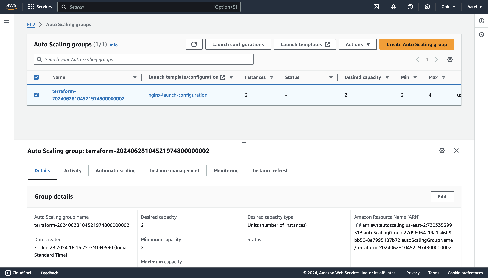
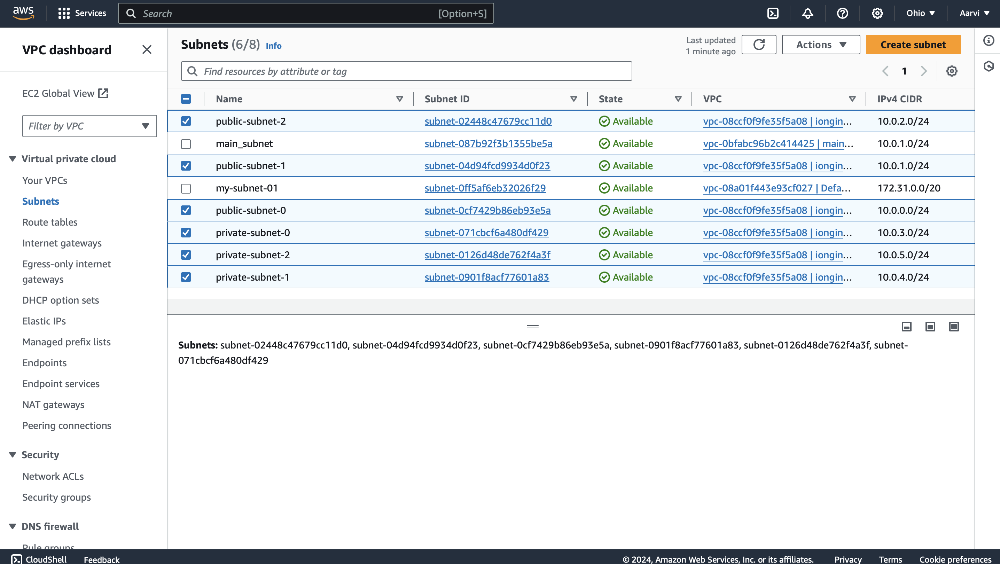
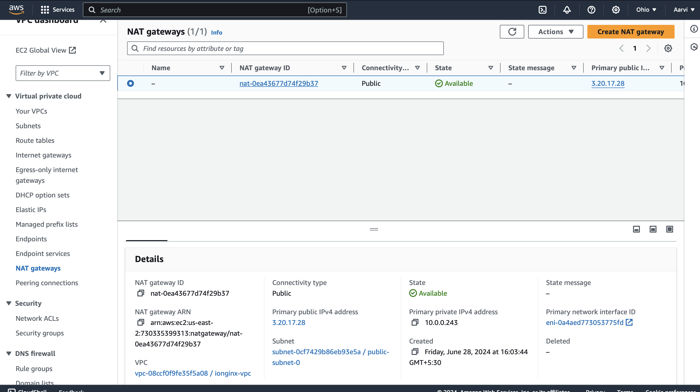
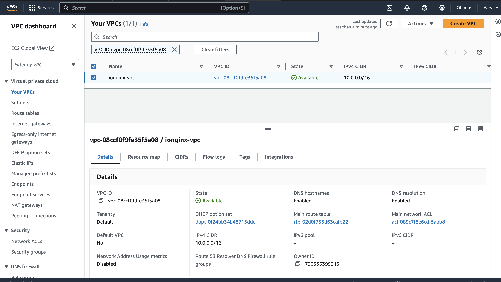

8. **Deployed Nginx on each server, with `Private-IP`**
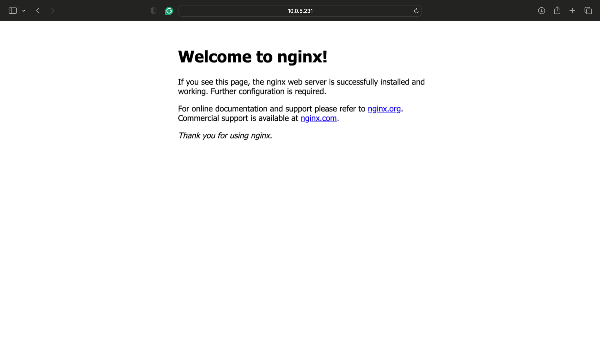
<i>Figure 1: EC2 Instance - Nginx-ASG I</i>

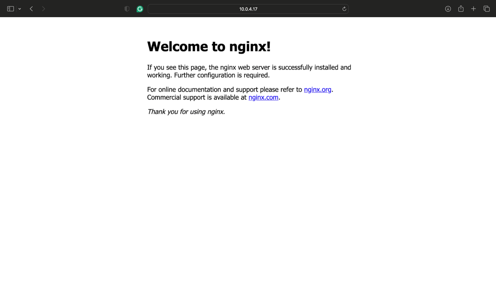
<i>Figure 2: EC2 Instance - Nginx-ASG II</i>


   
